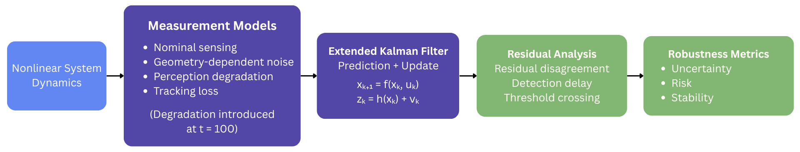
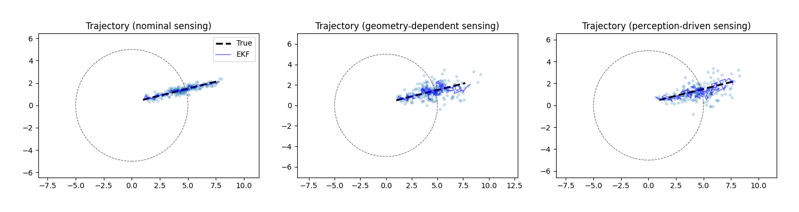
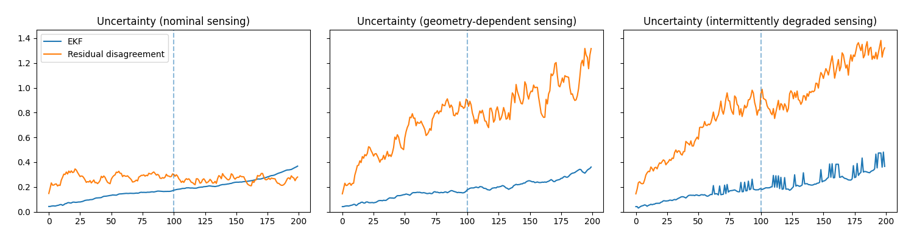
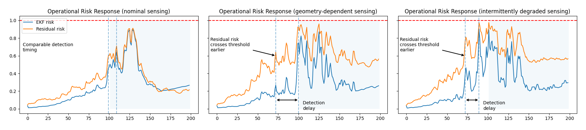

# Robust State Estimation Under Imperfect Sensing

## Abstract

This project studies how sensing degradation affects state estimation robustness in dynamical systems. An Extended Kalman Filter (EKF) is evaluated under three sensing regimes: nominal sensing, geometry-dependent sensing, and perception-driven sensing with intermittent tracking failures. Residual-based uncertainty and risk metrics are compared against covariance-based EKF confidence estimates to analyze detection delay, estimator stability, and failure behavior under imperfect perception.

## System Overview

## Core Questions
* How does sensing degradation affect estimator stability?
* When does EKF covariance fail to reflect true sensing uncertainty?
* Can residual-based metrics detect degradation earlier than covariance-based confidence estimates?
* How do different sensing modalities produce different estimator failure modes?

## Key Findings

* Residual disagreement detects sensing degradation earlier than covariance-based confidence estimates.
* Geometry-dependent and perception-like sensing produce delayed EKF awareness despite increasing measurement uncertainty.
* Tracking loss and perception degradation produce distinct uncertainty signatures.
* Stability metrics reveal when estimator confidence no longer reflects sensing reliability.

## Measurement Modalities

| Modality                   | Characteristics                                   | Failure Behavior    |
| -------------------------- | ------------------------------------------------- | ------------------- |
| Nominal sensing            | Low-noise direct measurements                     | Stable estimation   |
| Geometry-dependent sensing | Noise increases with distance                     | Gradual degradation |
| Perception-driven sensing  | Distance degradation + intermittent tracking loss | Bursty instability  |

## Key Results

**Figure 1. System trajectory across sensing modalities.**

_State estimation trajectories under nominal, geometry-dependent, and perception-driven sensing. Increasing sensing degradation produces wider measurement dispersion, noisier EKF trajectories, and intermittent tracking instability._

**Figure 2. Uncertainty comparison across sensing modalities.**

_EKF covariance uncertainty and residual disagreement under different sensing modalities. Geometry-dependent and perception-driven sensing produce elevated residual uncertainty and bursty estimator behavior, while nominal sensing remains comparatively stable._

**Figure 3. Risk comparison across sensing modalities.**

_Residual-based risk detects sensing degradation earlier than covariance-based EKF confidence in geometry-dependent and perception-driven sensing regimes. Under nominal sensing, detection timing remains nearly synchronous._

### Residual-based metrics detect degradation earlier
In geometry-dependent and perception-driven sensing, residual disagreement increases before covariance-based EKF confidence reflects instability. This creates measurable detection delay between sensing degradation and estimator awareness.

### EKF covariance can remain overconfident
Under intermittent perception failures, covariance growth remains comparatively smooth while residual disagreement becomes highly volatile. This suggests covariance alone may underestimate sensing instability during perception degradation.

### Different sensing modalities induce distinct failure modes
Nominal sensing produces bounded uncertainty and near-synchronous detection behavior. Geometry-dependent sensing produced gradual estimator drift, while perception-driven sensing generated intermittent bursts of instability tied to tracking loss events.

## Technical Implementation

### State Dynamics

A nonlinear 2D dynamical system was simulated and propagated through noisy sensing models.
$$
x_{k + 1} = f(x_k,u_k) + w_k
$$

### Measurement Model
Nominal sensing introduces Gaussian measurement noise. Geometry-dependent sensing increases measurement noise as a function of positional norm, while perception-driven sensing additionally introduces intermittent tracking loss and bursty degradation behavior.

### EKF Overview
An Extended Kalman Filter (EKF) performs nonlinear prediction and measurement updates using degraded observations.
$$
z_k = h(x_k) + v_k
$$

### Residual and Risk Metrics
Residual disagreement between the EKF estimate and the ground-truth trajectory was used to evaluate sensing consistency under degraded measurement conditions. Residual-based uncertainty was compared against covariance-derived EKF confidence estimates to analyze how rapidly each method responded to sensing degradation and estimator instability.

Operational risk was defined as a normalized ratio between estimator uncertainty and a predefined safe operating distance. This formulation couples estimator confidence with system geometry, allowing high-risk regions to emerge when uncertainty increases near operational boundaries. Threshold crossings in the resulting risk metric were used to measure detection delay between residual-based and covariance-based awareness of degradation.

Across geometry-dependent and perception-driven sensing regimes, residual-based metrics frequently responded earlier to degradation than covariance-based EKF confidence estimates, exposing delayed estimator awareness under imperfect sensing.

### Stability Analysis
Stability analysis evaluated whether estimator disagreement was dominated by underlying system dynamics or by sensing degradation. Under nominal sensing, stability remained largely bounded despite nonlinear motion. In geometry-dependent and perception-driven sensing regimes, measurement degradation increasingly dominated the stability metric, indicating that sensing uncertainty rather than system dynamics became the primary driver of estimator instability.

## Future Work
* Incorporate learned perception uncertainty models rather than handcrafted degradation schedules.
* Extend evaluation to higher-dimensional nonlinear systems and multi-agent estimation settings.
* Investigate adaptive covariance calibration under intermittent sensing failures.

## Conclusion
This project demonstrates how sensing degradation can produce estimator failure modes that are not fully captured by covariance-based confidence estimates alone. Residual-based diagnostics provide earlier indicators of instability under degraded perception and geometry-dependent sensing conditions. These behaviors become increasingly important in autonomous systems operating under unreliable perception, partial observability, or safety-critical sensing constraints.