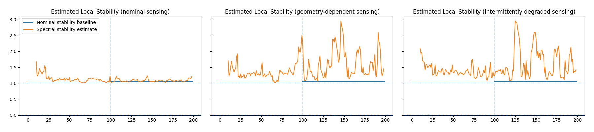

# Adaptive Sensing & Robust Estimation
## Research platform for partially observed dynamical systems under uncertainty.

This repository studies how degraded sensing alters estimator awareness, uncertainty behavior, and stability estimation in partially observed dynamical systems undergoing destabilizing dynamics.

The implemented systems combine nonlinear observers, recursive filtering, sensing-aware uncertainty analysis, and stability-inspired robustness diagnostics to study how sensing structure influences estimator convergence, uncertainty awareness, and stability under incomplete or unreliable observations.

Current experiments focus on geometry-dependent and intermittently degraded sensing regimes, where estimator confidence may diverge from true sensing reliability.

## Research Context

This repository supports ongoing research into robust
estimation and stability analysis for partially observed
dynamical systems.

The broader goal is to understand how sensing structure,
measurement uncertainty, and observation quality influence:

• estimator convergence
• uncertainty awareness
• reconstruction quality
• stability certification

Current experiments focus on nonlinear observers operating
under geometry-dependent and intermittently degraded sensing.

## Research Themes

- Robust state estimation
- Partial observability
- Stability-aware inference
- Recursive filtering
- Sensing degradation
- Dynamical systems robustness
- Uncertainty quantification
- Robust sensing systems
- Nonlinear observers

## Applications include:

- Autonomous sensing systems
- Tracking and navigation
- Remote sensing
- Environmental monitoring
- Learning-enabled estimation pipelines

## Overview

This project studies how degraded sensing alters estimator awareness, uncertainty behavior, and stability estimation in partially observed dynamical systems undergoing destabilizing dynamics.

An Extended Kalman Filter (EKF) is evaluated under three sensing regimes: nominal sensing, geometry-dependent sensing, and intermittently degraded sensing with intermittent estimator instability. Residual-based uncertainty and risk metrics are compared against covariance-based EKF confidence estimates to analyze detection delay, estimator stability, and failure behavior under degraded sensing conditions and unreliable observations.

## Key Findings

- Residual-based diagnostics detect sensing degradation earlier than covariance-based confidence estimates.
- Geometry-dependent sensing produces gradual estimator drift and delayed uncertainty awareness.
- Intermittently degraded sensing generates bursty instability and transient estimator overconfidence.
- Covariance estimates alone may underestimate instability under dynamically evolving sensing conditions.
- Stability-aware diagnostics provide improved visibility into estimator fragility under partial observability.

## System Overview
```text
Underlying destabilizing dynamics
                +
Degraded sensing
                ↓
Amplified instability fluctuations
Distorted stability awareness
Delayed estimator response
                ↓
Elevated operational fragility
```
## Core Questions

- How does sensing degradation affect estimator convergence and stability?
- When does estimator covariance fail to reflect true sensing uncertainty?
- Can residual-based diagnostics detect sensing degradation earlier than covariance-based confidence estimates?
- How do geometry-dependent and intermittently degraded sensing regimes produce different estimator failure modes?
- How can robust estimation be maintained under partial observability and dynamically evolving measurements?


## Sensing Regimes

| Sensing Regime                  | Characteristics                                                | Estimator Response                                  |
|---------------------------------|---------------------------------------------------------------|----------------------------------------------------|
| Nominal sensing                 | Low-noise direct observations with controlled destabilization | Comparatively bounded stability behavior           |
| Geometry-dependent degradation  | Observation quality degrades with system geometry             | Gradual instability amplification and delayed awareness |
| Intermittently degraded sensing | Time-varying sensing loss and unreliable observations         | Bursty instability excursions and elevated operational fragility |

The underlying destabilizing system dynamics remain identical across all sensing regimes; only the sensing structure and observation reliability are modified.
## Repository Structure

- `src/` — dynamics, sensing, estimation, and metric implementations
- `configs/` — experiment configurations
- `figures/` — generated figures and diagrams
- `experiments/` — experiment execution scripts

## Quickstart

```bash
git clone https://github.com/afleck18/adaptive-sensing-robustness.git
cd adaptive-sensing-robustness

pip install -r requirements.txt

python main.py
```

## Robustness & Stability Results
The following experiments evaluate how degraded sensing alters estimator behavior, uncertainty awareness, stability estimation, and operational risk under partial observability.

Across all experiments, the underlying destabilizing system dynamics remain identical while only the sensing structure and observation reliability are modified. This isolates the effect of degraded sensing on estimator awareness and stability behavior.


**Figure 1. Estimator behavior under progressively degraded sensing conditions.**

_State estimation trajectories under nominal, geometry-dependent, and intermittently degraded sensing regimes. As sensing quality deteriorates, estimator trajectories exhibit increased dispersion, reduced consistency, and transient observability loss. Geometry-dependent degradation produces gradual estimator drift, while intermittently degraded sensing generates bursty instability excursions and transient divergence behavior._

### Degraded sensing alters estimator behavior before catastrophic divergence

Under nominal sensing, estimator trajectories remain tightly coupled to the underlying system dynamics. As sensing quality degrades, estimator behavior becomes increasingly influenced by sensing unreliability rather than system dynamics alone.

Geometry-dependent degradation introduces gradual estimator drift, while intermittently degraded sensing produces transient instability events associated with unreliable observations and intermittent observability loss.


**Figure 2. Estimator uncertainty awareness under degraded sensing conditions.**

_Comparison between covariance-derived EKF uncertainty and residual-based disagreement metrics across sensing regimes. Under geometry-dependent and intermittently degraded sensing, residual disagreement increases substantially earlier than covariance-derived uncertainty estimates, indicating delayed estimator awareness of sensing degradation._

### Covariance-derived confidence can lag sensing instability

Under degraded sensing conditions, covariance-derived confidence estimates remain comparatively smooth despite rapidly increasing estimator disagreement.

Residual-based diagnostics respond earlier and more aggressively to sensing unreliability, suggesting that covariance alone may underestimate operational fragility under dynamically evolving observations and intermittent observability.



**Figure 3. Observation-derived stability estimation under degraded sensing conditions.**

_Comparison between nominal stability behavior and observation-derived stability estimates across sensing regimes. Under nominal sensing, estimated stability remains comparatively bounded and consistent. Geometry-dependent and intermittently degraded sensing produce amplified stability fluctuations and transient instability excursions despite identical underlying system dynamics. Stability estimate obtained from the dominant eigenvalue magnitude of the symmetric component of a locally estimated dynamics operator._

### Degraded sensing distorts stability awareness

Under nominal sensing conditions, observation-derived stability estimates remain relatively bounded despite controlled destabilizing dynamics.

As sensing quality deteriorates, estimated stability becomes increasingly volatile even though the underlying system dynamics remain unchanged. Geometry-dependent degradation produces gradual instability amplification, while intermittently degraded sensing generates bursty stability excursions tied to sensing unreliability and transient observability loss.

These results suggest that degraded sensing can distort estimator-derived stability awareness before catastrophic divergence becomes visually apparent.


**Figure 4. Operational risk response under degraded sensing conditions.**

_Residual-based and covariance-derived risk metrics under nominal, geometry-dependent, and intermittently degraded sensing regimes. Residual-based diagnostics consistently detect sensing instability earlier than covariance-derived estimator confidence, exposing measurable detection delay between sensing degradation and estimator awareness._

### Delayed estimator awareness produces elevated operational risk

In geometry-dependent and intermittently degraded sensing regimes, residual-based risk metrics cross operational thresholds substantially earlier than covariance-derived confidence estimates.

This detection delay indicates that estimator confidence can remain locally overconfident despite deteriorating sensing reliability, producing elevated operational fragility under partial observability and unreliable observations.

## Systems-Level Interpretation

Across all sensing regimes, degraded observations progressively shift estimator behavior from dynamics-dominated uncertainty toward sensing-dominated instability.

The experiments demonstrate that estimator confidence and observation-derived stability estimates may remain locally smooth even as sensing reliability deteriorates. Under geometry-dependent and intermittently degraded sensing, instability amplification and delayed estimator awareness emerge before catastrophic divergence becomes visually apparent.

These results suggest that robust estimation under partial observability may require stability-aware diagnostics extending beyond covariance-based filtering alone, particularly in systems operating under degraded sensing, unreliable observations, and dynamically evolving measurement conditions. These behaviors become increasingly important in autonomous, sensing-driven, and safety-critical systems operating under degraded observations and partial observability.

## Estimation & Stability Perspective

This repository studies robustness in partially observed dynamical systems by analyzing the interaction between sensing structure, estimator uncertainty, and stability behavior.

Rather than treating sensing degradation solely as a noise problem, the implemented framework evaluates how dynamically evolving observations influence estimator convergence, residual consistency, and operational reliability.

The experiments demonstrate that estimator confidence can remain locally smooth even as sensing reliability deteriorates, motivating the use of residual-based robustness diagnostics alongside covariance-aware filtering methods.

## Technical Implementation

### State Dynamics

A nonlinear 2D dynamical system was simulated and propagated through noisy sensing models.

$$
x_{k + 1} = f(x_k,u_k) + w_k
$$

### Measurement Model
Nominal sensing introduces Gaussian measurement noise. Geometry-dependent sensing increases measurement noise as a function of positional norm, while intermittently degraded sensing additionally introduces intermittent observability loss, unreliable observations, and bursty sensing degradation behavior.

### EKF Overview
An Extended Kalman Filter (EKF) performs nonlinear prediction and measurement updates using degraded observations.

$$
z_k = h(x_k) + v_k
$$

### Residual and Risk Metrics
Residual disagreement between the EKF estimate and the reference system trajectory was used to evaluate sensing consistency under degraded measurement conditions. Residual-based uncertainty was compared against covariance-derived EKF confidence estimates to analyze how rapidly each method responded to sensing degradation and estimator instability.


Operational risk was defined as a normalized ratio between estimator uncertainty and a predefined safe operating distance. This formulation couples estimator confidence with system geometry, allowing high-risk regions to emerge when uncertainty increases near operational boundaries. Threshold crossings in the resulting risk metric were used to measure detection delay between residual-based and covariance-based awareness of degradation.


Across geometry-dependent and intermittently degraded sensing regimes, residual-based metrics frequently responded earlier to degradation than covariance-based EKF confidence estimates, exposing delayed estimator awareness under degraded sensing and intermittent observability.

### Stability Analysis
Stability analysis evaluated how degraded sensing altered observation-derived stability estimates under identical underlying destabilizing system dynamics.
Under nominal sensing, stability estimates remained comparatively bounded despite the controlled destabilization introduced after the degradation onset. Under geometry-dependent and intermittently degraded sensing, stability estimates exhibited substantially larger fluctuations and transient excursions, indicating that degraded sensing amplified instability fluctuations and distorted estimator awareness of destabilizing dynamics. 

## Future Directions

- Adaptive covariance calibration under sensing degradation
- Stability-aware observer design
- Geometry-aware uncertainty estimation
- Learning-enabled sensing under partial observability
- Forced inverse problems and structured reconstruction
- Latent dynamical robustness analysis

## Conclusion

This project demonstrates how degraded sensing can produce estimator failure modes that are not fully captured by covariance-based confidence estimates alone.

Across geometry-dependent and intermittently degraded sensing regimes, residual-based diagnostics provide earlier indicators of instability amplification, sensing unreliability, and delayed estimator awareness under partial observability.

The results suggest that robust estimation in dynamically evolving sensing environments may require stability-aware diagnostics extending beyond covariance-aware filtering alone, particularly in autonomous and safety-critical systems operating under unreliable observations and intermittent observability.
